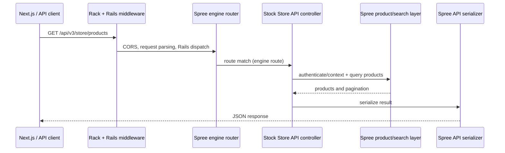
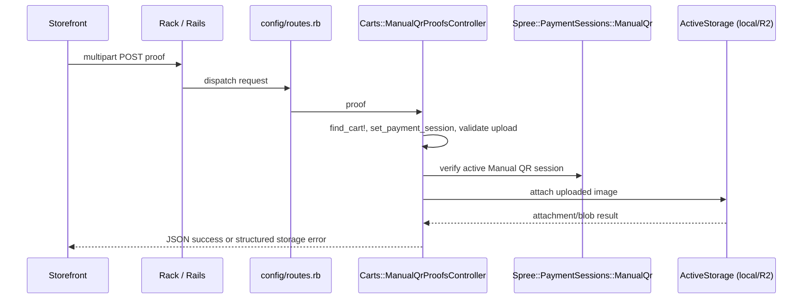
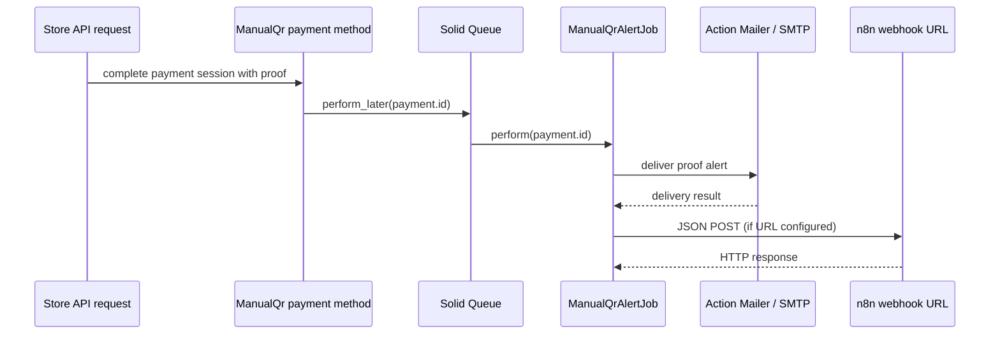

# Request lifecycle

The shared outer pipeline is approximately: Docker port → Puma → Rack middleware (including CORS/CSP and Rails middleware) → Rails router → mounted Spree engine or local action → auth/authorization → model/service → serializer or ERB → HTTP response. Exact ordering of engine internals should be confirmed from the installed gem.

## Store API: fetch products

`GET /api/v3/store/products` is a stock Store API route inside the mounted Spree engine. The route/controller implementation is in the installed Spree gem, not a local controller. The project route mount is `backend/config/routes.rb:117-125`; CORS is in `backend/config/initializers/cors.rb`; API customization and serializers live under `backend/app/serializers/spree/api/v3/`. **Unverified:** exact stock controller, query service, and serializer class/version-specific locations. Inspect the live route and gem source using the commands in `04_HOW_TO_FIND_THINGS.md`.



## Checkout and Manual QR proof upload

Concrete custom example: `POST /api/v3/store/carts/:cart_id/payment_sessions/:id/proof`. Route is added in `backend/config/routes.rb:84-90`; the cart proof controller is `backend/app/controllers/spree/api/v3/store/carts/manual_qr_proofs_controller.rb`. It finds the cart/session, validates the payment method/session and uploaded file, attaches proof through ActiveStorage, and returns Store API JSON. Spree's normal payment-session create/complete routes and checkout state pipeline are stock engine routes; inspect route output for exact installed version.



When the Store API completes the payment session, `Spree::PaymentMethod::ManualQr#complete_payment_session` requires proof, creates the Spree payment, leaves it pending for review, and enqueues `Spree::ManualQrAlertJob` (`backend/app/models/spree/payment_method/manual_qr.rb:181-209`). Thus a customer claim does not itself mark the funds verified.

## Admin request: approve Manual QR payment

The custom member route is `PUT /admin/orders/:order_id/payments/:id/approve` from `backend/config/routes.rb:24-38`. Devise admin authentication is set up at `backend/config/routes.rb:3-14`; Spree admin base authorization and the role ability are engine/app behavior. Local action code is prepended by `backend/config/initializers/spree.rb:44-59`; it checks pending/manual QR state and transitions payment to completed. The payment view partial renders the review controls at `backend/app/views/spree/admin/payments/_payment.html.erb`.

```mermaid
sequenceDiagram
    participant Admin as Admin browser
    participant Rack
    participant Router as Spree engine route
    participant Devise as Devise session auth
    participant Ability as CanCan / Spree permission sets
    participant Decorator as PaymentsControllerDecorator
    participant Payment as Spree::Payment
    Admin->>Rack: PUT approve (session cookie + CSRF token)
    Rack->>Router: route match
    Router->>Devise: require signed-in admin
    Devise-->>Router: current_spree_admin_user
    Router->>Ability: authorize admin action
    Ability-->>Router: allowed / denied
    Router->>Decorator: approve action extension
    Decorator->>Payment: load, check pending QR, complete payment
    Payment-->>Admin: redirect + flash; order page renders updated state
```

**Unverified:** the precise stock admin controller callback sequence is inside the installed Spree gem. Local action behavior: `backend/app/controllers/spree/admin/payments_controller_decorator.rb`.

## Webhook fired for newly uploaded QR proof

This is the custom alert webhook to n8n configured per Manual QR method; it is not the same as Spree's general configurable event webhook delivery system. Session completion enqueues the job; the job sends optional alert email and a JSON POST. Related files: `backend/app/models/spree/payment_method/manual_qr.rb:203-207`, `backend/app/jobs/spree/manual_qr_alert_job.rb`, `backend/app/mailers/spree/manual_qr_mailer.rb`.



For Spree's standard webhooks, registered event subscriptions and delivery jobs are gem-owned; exact emitter and delivery path are **Unverified** locally. See `config/initializers/spree.rb:193-210` for dedicated webhook queues and `db/migrate/20260317146064_create_spree_webhook_endpoints.spree.rb` / `20260317146065_create_spree_webhook_deliveries.spree.rb` for schema.
